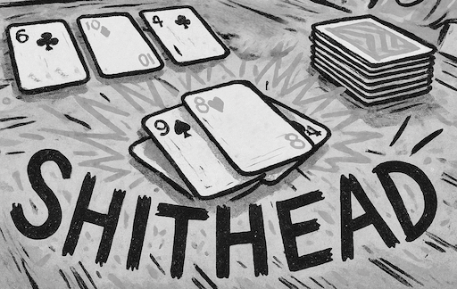

# Rules

## Goals

- The last player to play all of their cards loses and becomes the Shithead
- There are no winners in the game, only one Shithead

### Playing

- Players take turns playing cards clock-wise around the table
- Players must always play the same card or higher than the previous player unless a special card is in effect
- When a player cannot play, they pick up the pile of all played cards and place it in their hand
  - When a player picks up the pile of all played cards, they lose their turn
- Players play cards from their hands until no more cards remain in their hand
  - Players can only play cards from their hand while cards remain in their hand
- Players play the face-up cards placed in front of them when they have no cards in their hand
  - Players cannot play face-down cards while they have any face-up cards
- Players play their face-down cards when they have no face-up cards to play
  - Players cannot pick up and look at their face-down cards
- Players must play if they can do so
- Players must draw as many cards as they play from their hands back into their hands while there are cards available in the draw-pile

## Setup

- Shuffle a standard 52-card pack
- Players are dealt three face-down cards
- Players are dealt three face-up cards
  - Players place each face-up card on top of each face-down card in front of them
- Players are dealt three face-down cards for their hand
- Players pick up their dealt hands
- The remaining cards are placed in a draw-pile

### 5+ players

- Only two face-down cards, two face-up cards and two hand cards are dealt to players
  - Alternatively, include two Jokers to allow all players to be dealt cards

## Cards

- All cards rank in their natural order. Aces are high, suits are disregarded
- Multiple cards of the same rank from players' hands and face-up cards can be played at the same time
- A set of four of the same cards takes all currently played cards out of the game
  - The player that takes all currently played cards out of the game plays again
  - If a player can complete a set of all four cards for the currently played card, they can play those cards even if it is not their turn

### Special Cards

#### Card that can be played on all cards

- 2: Resets the current played card to 2
- 3: The card underneath the played 3 is still in effect
- 10: Takes all currently played cards out of the game
  - The player that played 10 plays again
- Joker: Reverses the direction of play

#### Cards that have to be played in natural order

- 7: The next player must play 7 or below 7
- 8: Skips the next player
  - The number of played 8 determines how many players are skipped
  - Players cannot skip themselves

#### Extensions

- 4: The next player must play a card of the same color as the played 4
  - 4 can be played on any 4, no matter the color
- Q: Reverses the direction of play
- 10: Cannot be played on 7

## Starting the Game

- The Shithead from the previous round starts the game
  - Any player with 4♡ starts if there is no Shithead from a previous round
  - Any player with 4 starts if there is no player with 4♡
  - Any player with the card closest to 4 starts if there is no player with 4

### Before the Game Starts

- Players can swap any of their three face-up cards with cards from their hand
